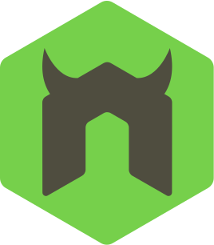
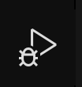

### Updated April 3, 2025
# Using Nodemon and Visual Studio Code Debugger together to Automate Debugging Workflow
 

### Quick Start / TL;DR (Attach Method)

1.  **Install Nodemon:** `npm install --save-dev nodemon` (local) or `npm install -g nodemon` (global).
2.  **Run App:** Start your Node.js app with Nodemon and the inspect flag: `nodemon --inspect server.js` (replace `server.js` with your entry point).
3.  **Configure VS Code:** Add the following `attach` configuration to your `.vscode/launch.json`:
    ```json
    {
      "type": "node",
      "request": "attach",
      "name": "Attach to Nodemon",
      "port": 9229, 
      "restart": true,
      "skipFiles": ["<node_internals>/**"]
    }
    ```
4.  **Start Debugging:** In VS Code's Run and Debug view, select "Attach to Nodemon" from the dropdown and click the "Start Debugging" (play) button or press F5.

*(For detailed explanations and alternative methods, read the sections below.)*

#### In this tutorial I will explain how to attach the Visual Studio Code debugger to a nodeJS app launched by [Nodemon.](https://github.com/remy/nodemon)

##### Why do you want this?
While running a nodeJS app in VS Code debugger mode you have to re-launch the debugger every time you make a change to one of your app files. This takes time and is tedious. VS Code actually allows you to attach a debugger to any currently running nodeJS app.
So, attaching the debugger to an app launched by nodemon will allow you to use the VS Code debugger in an app that is _automatically re-launched_ on every changed file. This removes a few steps from the development process and streamlines workflow with the VS Code debugger.

## Setting Up Nodemon
To start, Install [nodemon](https://github.com/remy/nodemon) globally on your machine. by running: `npm install -g nodemon
` or install locally in your project: `npm install --save-dev nodemon`

## Setting Up VS Code Debugger
If you already have a launch.json for your project you can <a href="#configurations">skip</a> this step.

To Set up the VS Code debugger, first bring up the Run and Debug view by clicking the corresponding icon in the sidebar (usually a play button with a bug).



If you don't have a `launch.json` file yet, click the "create a launch.json file" link in the Run and Debug view. Select "Node.js" when prompted for the environment. VS Code will create a `.vscode/launch.json` file in your workspace with some default configurations.

<a name="configurations"></a>
#### Configurations

The `launch.json` file contains an array named `"configurations"`. Each object in this array defines a specific debug setup. For integrating with Nodemon, we are interested in an `"Attach"` configuration.

A typical "Attach" configuration allows the VS Code debugger to connect to a Node.js process that's already running, like one started with `nodemon --inspect`.

Here's an example of an "Attach" configuration suitable for Nodemon:

```json
{
  "version": "0.2.0",
  "configurations": [
    {
      "type": "node",
      "request": "attach",
      "name": "Attach to Nodemon",
      "port": 9229, // Default inspect port
      "restart": true, // Automatically re-attach after nodemon restarts
      "skipFiles": [
        "<node_internals>/**"
      ]
    }
    // You might have other configurations here, like a "Launch" one
  ]
}
```

_Key properties explained:_
*   `"type": "node"`: Specifies the debugger type for Node.js (using the modern Inspector Protocol).
*   `"request": "attach"`: Tells VS Code to attach to an existing process.
*   `"name"`: A descriptive name that will appear in the Debug configuration dropdown.
*   `"port": 9229`: The port Node.js is listening on for debugger connections (this matches the default for `--inspect`). Change this if you use a different port (e.g., `nodemon --inspect=9230`).
*   `"restart": true`: **This is crucial for Nodemon.** It tells the VS Code debugger to automatically try and re-attach whenever the Node.js process (restarted by Nodemon) terminates. This avoids manually restarting the debugger session each time Nodemon detects a file change.
*   `"skipFiles"`: Helps in stepping over internal Node.js code during debugging.

_To learn more about all available options, consult the_ [Visual Studio Code Node.js Debugging documentation](https://code.visualstudio.com/docs/nodejs/nodejs-debugging).

#### Running your Application
You should be all set up to run your application with Nodemon first. Go to your command line and type:

`$ nodemon --inspect server.js`

if you would like to specify a particular port to run your application on, you can enter:

`PORT=5000 nodemon --inspect server.js`

_(Note: `server.js` should be replaced with your app's entry point file. The `--inspect` flag tells Node.js to start listening for a debugger client on the default port 9229. You can specify a different port like `--inspect=9230`)_

you should see output similar to this:

~~~
[nodemon] <nodemon_version>
[nodemon] to restart at any time, enter `rs`
[nodemon] watching path(s): *.*
[nodemon] watching extensions: js,mjs,json
[nodemon] starting `node --inspect server.js`
Debugger listening on ws://127.0.0.1:9229/xxxxxxxx-xxxx-xxxx-xxxx-xxxxxxxxxxxx
For help, see: https://nodejs.org/en/docs/inspector
Server listening on port :5000 (or whichever port your app uses)
~~~

Now your app is being launched by Nodemon and is ready for the debugger. Any saved changes you make will re-launch your application.

#### Attaching the Debugger in VS Code
With your application running via Nodemon, you can now attach the VS Code debugger.

1.  Go back to the VS Code Run and Debug view.
2.  Click the dropdown menu at the top and select the name you gave your attach configuration (e.g., "Attach to Nodemon").
3.  Click the "Start Debugging" (play) button or press F5.

The VS Code debugger is now attached and will automatically re-attach when Nodemon restarts the server. Debugger controls, breakpoints, variable inspection, and console output will now be active in VS Code.

---
### Alternative: Launching Nodemon Directly from VS Code

Instead of running Nodemon manually in the terminal and then attaching, you can configure VS Code to launch Nodemon *for* you with the debugger already active. This uses a `"request": "launch"` configuration.

Example `launch.json` configuration:

```json
{
    "type": "node",
    "request": "launch",
    "name": "Launch via Nodemon",
    "runtimeExecutable": "nodemon", // Use nodemon to run the script
    "args": [
        "--inspect", // Enable the inspector
        "${workspaceFolder}/server.js" // Your entry script
    ],
    "restart": true, // Re-attach on process termination (nodemon restart)
    "console": "integratedTerminal", // Show output in VS Code's integrated terminal
    "internalConsoleOptions": "neverOpen", // Don't open the Debug Console automatically
    "skipFiles": [
        "<node_internals>/**"
    ]
}
```

_Key differences from Attach:_
*   `"request": "launch"`: Tells VS Code to start the process.
*   `"runtimeExecutable": "nodemon"`: Specifies that Nodemon should be used to run the code instead of Node directly.
*   `"args"`: Contains the arguments passed to Nodemon, including `--inspect` and the script name.

With this configuration, you simply select "Launch via Nodemon" from the Run and Debug dropdown and click "Start Debugging" (F5). VS Code will start Nodemon, and the debugger will be attached automatically. Nodemon's output will typically appear in the integrated terminal specified by the `"console"` option.

---
### Alternative: Using `nodemon.json`

Instead of adding the `--inspect` flag every time you run nodemon, you can configure it in a `nodemon.json` file at the root of your project. This is often the preferred way to manage Nodemon settings.

Example `nodemon.json`:

```json
{
  "watch": ["src/**/*.js", "server.js"], // Specify files/folders to watch
  "ext": "js,json", // Specify extensions to watch
  "ignore": ["node_modules/"], // Specify paths to ignore
  "execMap": {
    "js": "node --inspect=9229"
  } // Tell nodemon how to execute .js files, including the inspect flag
}
```

With this `nodemon.json`, you can simply run `$ nodemon server.js` (or your entry point), and the `--inspect` flag will be automatically included.

---
### Note on VS Code Auto Attach

VS Code also offers an "Auto Attach" feature (configurable in VS Code settings) that can automatically attach the debugger when Node.js processes are launched in debug mode from the integrated terminal. While convenient, using an explicit `launch.json` "Attach" configuration with `"restart": true` (as shown above) is often more reliable and recommended for seamless integration with Nodemon's restart behavior.
