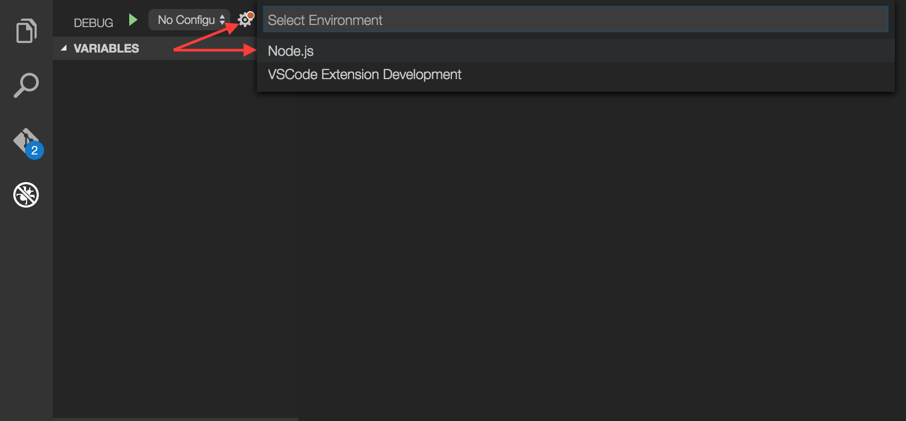
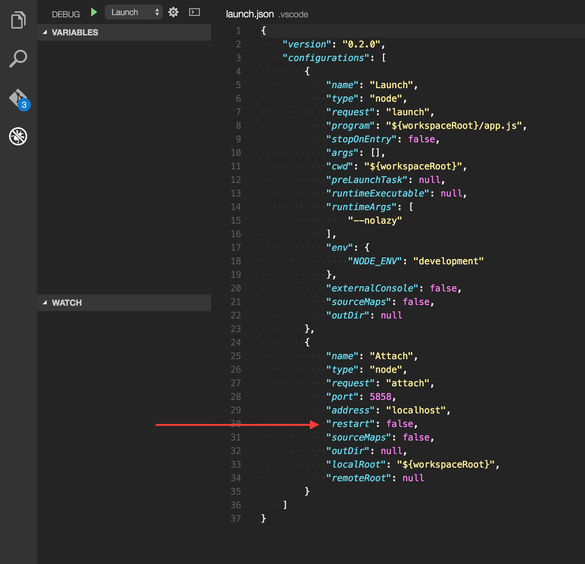
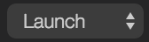
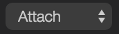
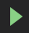

# Using nodemon and Visual Studio Code Debugger together

#### In this tutorial I will explain how to attach the Visual Studio Code debugger to a nodeJS app launched by [Nodemon.](https://github.com/remy/nodemon)

##### Why do I want this?
While running a nodeJS app in VS Code debugger mode you have to re-launch the debugger every time you make a change to one of your app files. This takes time and is tedious. VS Code actually allows you to attach a debugger to any currently running nodeJS app.
So, attaching the debugger to an app launched by nodemon will allow you to use the VS Code debugger in an app that is _automatically re-launched_ on every changed file. This removes a few steps from the development process and streamlines workflow with the VS Code debugger.

## Setting Up Nodemon
To start, Install [nodemon](https://github.com/remy/nodemon) globally on your machine. by running: `npm install -g nodemon
` or install locally in your project: `npm install --save-dev nodemon`

## Setting Up VS Code Debugger
If you already have a launch.json for your project you can <a href="#configurations">skip</a> this step.

To Set up the VS Code debugger, first bring up the debug view by clicking the debug icon in the sidebar.

Once you have the debug view open, click the settings gear. This will open a popup that allows you to select your enviornment, in this case, click Node.js.

VS Code will now create a configuration file, titled launch.json. It should look something like this:

#### Configurations
There will be two `"configurations"`, Which configuration is available depends on which one you request VS Code to use. `"Launch"` will launch the current project 
in debug mode, while `"Attach"` will allow the VS Code debugger to attach itself to an app that is running elsewhere on your system, for instance, an app launched by nodemon.

_To see more about the launch.json file and how to configure it, consult the_ [Visual Studio Code documentation](https://code.visualstudio.com/Docs/editor/debugging)

In order for you to run nodemon with VS Code, you have to **set the attribute `"restart"` to `true`**. This sets the VS Code debugger to re-attach to your node.js application after it is 
terminated by nodemon. This is useful because nodemon will restart the app on every save made.

 _From VS Code Docs:_
> The restart attribute controls whether the Node.js debugger automatically restarts after the debug session has ended. This feature is useful if you use nodemon to restart Node.js on file changes. Setting the launch configuration attribute restart to true makes node-debug automatically try to re-attach to Node.js after Node.js has terminated.

#### Setting the request to "attach" in VS Code
Once the launch.json file is setup it's time to change the request you are making to the VS Code debugger. Ordinarily one might just request that VS Code "Launch"
 the app in debugger mode, but since VS Code does not have any utility like nodemon that will restart the app on new changes, you need to _attach_ the VS Code debugger to the external application that is being run by nodemon.
To do this simply click on the menu item in the debugger view and change  to .

#### Running the Application
You should be all set up, so to run your application with nodemon and debugger attached type:

`$ nodemon --debug server.js`

you should see:

~~~
[nodemon] 1.9.2
[nodemon] to restart at any time, enter `rs`
[nodemon] watching: *.*
[nodemon] starting `node --debug server.js`
Debugger listening on port 5858
Server listening on port :50717
~~~

Now your app is being launched by nodemon. Next you must attach the VS Code debugger to your running app. 
Go back to your VS Code debug view and click the "Play" icon. The VS Code debugger is now available to you to use and errors and console feedback will appear in your command line where you ran nodemon.
