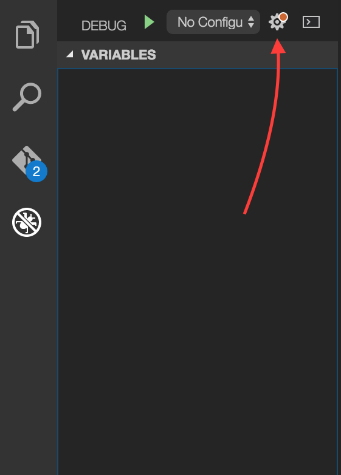

# Using nodemon in Visual Studio Code Debugger

#### In this tuorial I will explain how to attach the Visual Studio Code debugger to an app launched by [Nodemon.](https://github.com/remy/nodemon)

## Setting Up VS Code Debugger
To Set up the VS Code debugger, first bring up the debug view by clicking the debug icon in the sidebar.

Once you have the debug view open, click the settings gear. This will open a popup that allows you to select your enviornment, in this case, click Node.js. 

vs code will now  create a configuration file for you, titled launch.json. It should look something like this.

There will be two `"configurations"`. Which configuration is available to us depends on which one we request VS Code to use. `"Launch"` will launch the current project 
in debug mode, while `"Attach"` will allow the VS Code debugger to attach itself to an app that is running elsewhere on your system, for instance, our app launched by nodemon.

_To see more about the launch.json file and how to configure it, consult the _ [Visual Studio Code documentation](https://code.visualstudio.com/Docs/editor/debugging)

In order for us to run nodemon with VS Code, we have to set the attribute `"restart"` to `true`. This allows the VS Code debugger to re-attach to our node.js application after it is 
terminated by nodemon. _From VS Code Docs:_
> The restart attribute controls whether the Node.js debugger automatically restarts after the debug session has ended. This feature is useful if you use nodemon to restart Node.js on file changes. Setting the launch configuration attribute restart to true makes node-debug automatically try to re-attach to Node.js after Node.js has terminated.

Once your launch.json file is setup we need to change t